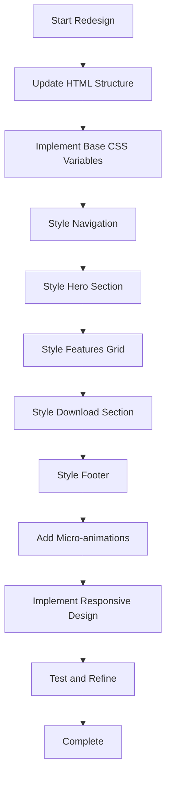

# SysMon Website Redesign Plan

## Minimalist Luxury Aesthetic

---

## Design Philosophy

Transform the SysMon website from a dark, industrial "Terminal Noir" aesthetic to an **ultra-refined minimalist luxury** experience. This direction creates a striking contrast with typical developer tool websites, positioning SysMon as a premium, sophisticated system monitoring solution.

### Core Principles

1. **Whitespace as Design** - Generous negative space creates breathing room and emphasis
2. **Typography-First** - Refined, distinctive fonts carry the visual weight
3. **Subtle Motion** - Micro-animations that feel effortless and refined
4. **One Powerful Accent** - A single, confident color choice against muted tones
5. **Editorial Structure** - Magazine-inspired layout with clear hierarchy

---

## Visual Specifications

### Color Palette

```
Primary Background:  #FAFAFA  (off-white, warm)
Secondary Background:#FFFFFF  (pure white for cards)
Text Primary:        #1A1A1A  (near-black, soft)
Text Secondary:      #6B6B6B  (warm gray)
Text Muted:          #9A9A9A  (light gray for meta)

Accent Color:        #C9A962  (muted gold/champagne)
Accent Hover:        #B8963F  (deeper gold)
Accent Subtle:       rgba(201, 169, 98, 0.08)

Borders:             rgba(0, 0, 0, 0.06)
Shadows:             rgba(0, 0, 0, 0.03) to rgba(0, 0, 0, 0.08)
```

### Typography

**Display Font: Playfair Display**

- Elegant serif for headlines
- Creates editorial, premium feel
- Weights: 400, 500, 600, 700

**Body Font: Inter**

- Clean, highly readable sans-serif
- Excellent for UI elements
- Weights: 300, 400, 500, 600

**Monospace: JetBrains Mono**

- Retained for technical elements
- Creates nice contrast with serif

```
--font-display: 'Playfair Display', Georgia, serif;
--font-body: 'Inter', -apple-system, sans-serif;
--font-mono: 'JetBrains Mono', monospace;

/* Scale */
--text-xs: 0.75rem;    /* 12px */
--text-sm: 0.875rem;   /* 14px */
--text-base: 1rem;     /* 16px */
--text-lg: 1.125rem;   /* 18px */
--text-xl: 1.25rem;    /* 20px */
--text-2xl: 1.5rem;    /* 24px */
--text-3xl: 2rem;      /* 32px */
--text-4xl: 2.5rem;    /* 40px */
--text-5xl: 3.5rem;    /* 56px */
--text-6xl: 4.5rem;    /* 72px */
```

### Spacing System

```
--space-xs: 0.25rem;   /* 4px */
--space-sm: 0.5rem;    /* 8px */
--space-md: 1rem;      /* 16px */
--space-lg: 1.5rem;    /* 24px */
--space-xl: 2rem;      /* 32px */
--space-2xl: 3rem;     /* 48px */
--space-3xl: 4rem;     /* 64px */
--space-4xl: 6rem;     /* 96px */
--space-5xl: 8rem;     /* 128px */
```

### Border Radius

```
--radius-sm: 4px;
--radius-md: 8px;
--radius-lg: 12px;
--radius-xl: 20px;
```

---

## Layout Architecture

### Hero Section

```
┌─────────────────────────────────────────────────────────────┐
│  [Logo] SysMon                              Nav Links       │
│                                                             │
│                                                             │
│           System Intelligence,                              │
│           Reimagined.                                       │
│                                                             │
│           Refined system monitoring crafted with Rust.      │
│           Real-time insights. Zero bloat. Beautiful.        │
│                                                             │
│           [Download]  Learn More                            │
│                                                             │
│                                                             │
│   ┌─────────────────────────────────────────────────────┐   │
│   │                                                      │   │
│   │              App Screenshot                          │   │
│   │              (Elegant card with subtle shadow)       │   │
│   │                                                      │   │
│   └─────────────────────────────────────────────────────┘   │
│                                                             │
└─────────────────────────────────────────────────────────────┘
```

### Features Section

```
┌─────────────────────────────────────────────────────────────┐
│                                                             │
│                      Capabilities                           │
│                                                             │
│           Everything you need. Nothing you don't.           │
│                                                             │
│  ┌──────────────┐  ┌──────────────┐  ┌──────────────┐       │
│  │    Icon      │  │    Icon      │  │    Icon      │       │
│  │              │  │              │  │              │       │
│  │  Real-time   │  │  Performance │  │   Process    │       │
│  │  Dashboard   │  │   Graphs     │  │   Manager    │       │
│  │              │  │              │  │              │       │
│  │  Description │  │  Description │  │  Description │       │
│  └──────────────┘  └──────────────┘  └──────────────┘       │
│                                                             │
│  ┌──────────────┐  ┌──────────────┐  ┌──────────────┐       │
│  │    Icon      │  │    Icon      │  │    Icon      │       │
│  │  GPU Metrics │  │  Per-Core    │  │    Smart     │       │
│  │              │  │    CPU       │  │   Alerts     │       │
│  └──────────────┘  └──────────────┘  └──────────────┘       │
│                                                             │
└─────────────────────────────────────────────────────────────┘
```

### Download Section

```
┌─────────────────────────────────────────────────────────────┐
│                                                             │
│                                                             │
│         One File. Zero Install.                             │
│         Just Run.                                           │
│                                                             │
│         Download the portable executable and your           │
│         system is transparent. No runtime required.         │
│                                                             │
│                    [Download for Windows]                   │
│                                                             │
│           Windows 10+ • x64 • ~5.5 MB                       │
│                                                             │
│                                                             │
└─────────────────────────────────────────────────────────────┘
```

---

## Micro-Animations

### Page Load Sequence

1. **Logo fade-in** - 0ms, duration 400ms
2. **Nav links stagger** - 100ms apart, fade + translate up
3. **Hero headline** - 300ms, fade + translate up
4. **Hero description** - 450ms, fade
5. **CTA buttons** - 550ms, fade + scale from 0.95
6. **Screenshot card** - 700ms, fade + translate up with shadow grow

### Scroll Animations

- **Feature cards**: Fade in with subtle translate-up on intersection
- **Section headers**: Elegant fade with slight scale
- **Stagger delay**: 80ms between sibling elements

### Hover States

- **Buttons**: Subtle scale (1.02), shadow increase, accent color shift
- **Cards**: Gentle lift (translateY -4px), shadow enhancement
- **Links**: Underline animation from center outward
- **Icons**: Subtle rotation or scale

### Transitions

```css
--ease-out: cubic-bezier(0.16, 1, 0.3, 1);
--ease-in-out: cubic-bezier(0.65, 0, 0.35, 1);

--duration-fast: 150ms;
--duration-normal: 250ms;
--duration-slow: 400ms;
```

---

## Component Specifications

### Navigation

- **Background**: Transparent on hero, white with subtle shadow on scroll
- **Height**: 72px
- **Logo**: Text-based with elegant serif
- **Links**: Small caps, letter-spacing, hover underline animation
- **Mobile**: Full-screen overlay with centered links

### Buttons

**Primary Button**

```
Background: Accent gold
Text: White
Padding: 14px 32px
Border-radius: 8px
Font: Inter 500
Shadow: Subtle elevation
Hover: Scale 1.02, deeper shadow
```

**Secondary Button**

```
Background: Transparent
Border: 1px solid border color
Text: Text primary
Hover: Light background fill
```

### Feature Cards

```
Background: White
Border-radius: 16px
Padding: 32px
Shadow: Layered, subtle
Border: 1px solid rgba(0,0,0,0.04)
Hover: Translate up, shadow increase
```

### Screenshot Frame

```
Background: White
Border-radius: 20px
Shadow: Large, soft elevation
Border: 1px solid rgba(0,0,0,0.04)
Overflow: Hidden
```

---

## Responsive Breakpoints

```css
/* Mobile First */
@media (min-width: 640px) {
  /* sm */
}
@media (min-width: 768px) {
  /* md */
}
@media (min-width: 1024px) {
  /* lg */
}
@media (min-width: 1280px) {
  /* xl */
}
@media (min-width: 1536px) {
  /* 2xl */
}
```

### Mobile Adaptations

- Single column layout
- Reduced typography scale
- Simplified navigation
- Touch-friendly tap targets (44px minimum)
- Stacked hero content

---

## File Changes Required

### 1. `index.html`

- Restructure semantic layout
- Update content hierarchy
- Add new class names
- Update Google Fonts import

### 2. `styles.css`

- Complete rewrite with new aesthetic
- New CSS custom properties
- Refined component styles
- Enhanced animations

### 3. `script.js`

- Update scroll animations
- Refine intersection observer
- Add elegant transitions

---

## Implementation Flow Diagram



---

## Key Differentiators from Current Design

| Aspect     | Current                 | New                       |
| ---------- | ----------------------- | ------------------------- |
| Background | Dark charcoal #08090c   | Warm off-white #FAFAFA    |
| Accent     | Electric cyan #00e5ff   | Muted gold #C9A962        |
| Typography | Outfit + JetBrains Mono | Playfair Display + Inter  |
| Texture    | Film grain overlay      | Clean, no texture         |
| Cards      | Dark with cyan borders  | White with subtle shadows |
| Feel       | Industrial, technical   | Refined, editorial        |
| Animation  | Glitch, pulse           | Subtle fade, elegant ease |

---

## Next Steps

1. **Switch to Code mode** to implement the redesign
2. Start with HTML structure updates
3. Implement CSS from scratch with new variables
4. Add refined JavaScript interactions
5. Test across devices and browsers
